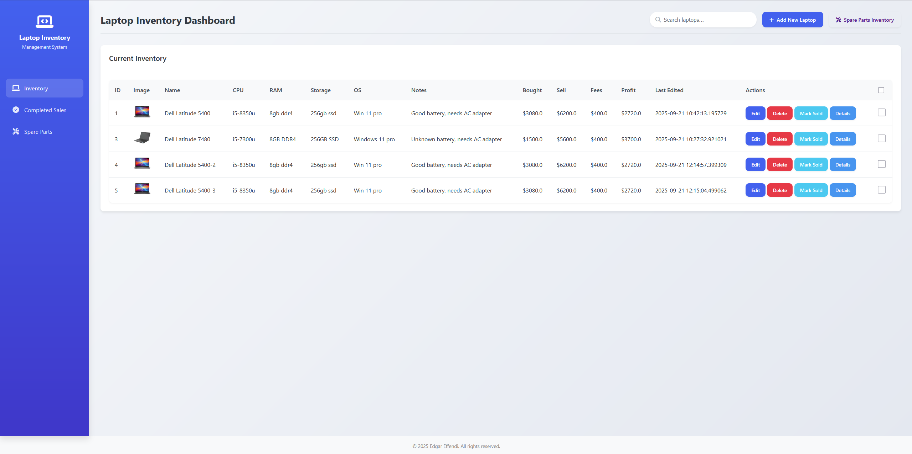

# Laptop Inventory Management System v1.0

A web-based tool I built for managing laptop inventory, spare parts, and sales. Uses Flask and Docker, stores everything in a database so it works reliably across different computers.


*Main inventory view with all laptops and their details*


*Adding a new laptop to the inventory*


*Editing laptop details and managing multiple images*


*Selecting multiple laptops for bulk operations*


## What It Does

### Smart Serial Numbers
Instead of just using 1, 2, 3... this generates proper serial numbers like **DE092501** (Dell laptop, added in September 2025, #1 for that month). Works for all major brands and automatically detects them from the laptop name.

### Track Everything
- Laptop specs (CPU, RAM, storage, operating system)
- Purchase price, selling price, fees, and automatic profit calculation
- Multiple photos per laptop stored in the database
- When you bought it, when you sold it, profit margins
- Search through everything quickly

### Handle Spare Parts
Keep track of RAM sticks and storage drives separately, then link them to laptops when you install upgrades. Shows which laptops have extra components installed.

### Bulk Operations
Select multiple laptops and delete or duplicate them all at once. The duplicate feature creates copies with new serial numbers and adds "(Copy)" to the name.

### Sales Tracking
Mark laptops as sold and they move to a separate "completed sales" section. Track your total profits and see which laptops made the most money.

## Why I Built This

I buy, repair, and sell laptops as a side business. Existing solutions were either too complicated, too expensive, or didn't handle images properly. I wanted something that:

- Stores images in the database (not as files that can get lost)
- Generates professional-looking serial numbers
- Works the same whether I'm on my desktop or laptop
- Handles spare parts and upgrades
- Actually calculates profits correctly

## How It Works

### Database Design
Everything is stored in SQLite with proper relationships. Images are stored as binary data in the database, so they can't get lost when you move the database file around.

### User Interface
Clean design with a blue sidebar for navigation. Uses real buttons and forms, not fancy JavaScript frameworks that break. Responsive so it works on tablets too.

### Serial Numbers
The system looks at the laptop name (like "Dell Latitude 5400") and figures out it's a Dell, then generates DE092501 for the first Dell added in September 2025. Much better than random IDs.

## Installation

### With Docker (Recommended)
```bash
git clone https://github.com/Ang-edgar/laptop-inventory-management.git
cd laptop-inventory-management
docker-compose up -d
```
Open http://localhost:5000 in your browser.

### Without Docker
```bash
pip install flask werkzeug
python app/app.py
```

## Features I'm Proud Of

- **Image management**: Upload multiple photos, set one as primary, delete individually
- **Bulk operations**: Select multiple laptops and handle them all at once  
- **Smart serial numbers**: Professional inventory codes with date and brand info
- **Spare parts tracking**: Know exactly what components you have and where they're installed
- **Profit calculations**: See exactly how much money you're making
- **No dependencies**: Runs entirely from the database file, easy to backup

## Who This Is For

- People who buy and sell laptops (like me)
- Computer repair shops that need inventory tracking
- Anyone managing more than a few laptops and getting tired of spreadsheets
- IT departments tracking company assets

## Latest Changes (v1.0)

- New serial number system with date integration (DE092501 format)
- Better image upload with drag-and-drop
- Bulk select and operations
- Cleaner button designs and hover effects
- Toast notifications when you save changes
- Fixed all the database migration issues

## Technical Details

- **Backend**: Python Flask
- **Database**: SQLite with proper foreign keys
- **Storage**: Images stored as BLOB data (portable across computers)
- **Deployment**: Docker containers with persistent volumes
- **Frontend**: Plain HTML/CSS/JavaScript (no heavy frameworks)

Built by Edgar Effendi in 2025. MIT license - use it however you want.