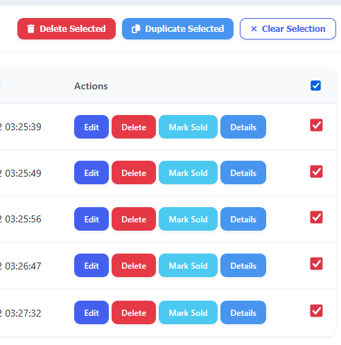

# Laptop Inventory Management System v1.21b (Beta)

A web-based tool for managing laptop inventory, spare parts, sales, warranty tracking, customer order management, and now **Google Drive cloud sync**. Uses Flask and Docker, stores everything in a database so it works reliably across different computers.

## 🚀 New in v1.2b (Beta)

- **Guest & Admin Modes:**  
  - Customers (guests) can browse your store’s current stock without logging in.
  - Admins log in to manage inventory, orders, sales, and more.

- **Order System:**  
  - Guests can add multiple laptops to a cart and place an order.
  - Admins can view, confirm, reject, and process orders.
  - Orders move through statuses: unconfirmed, confirmed, in progress, completed.
  - Admins can revert completed sales back to orders if needed.

- **Order Tracking:**  
  - Guests can check their order status by email.

- **Google Drive Sync (NEW in v1.21b):**
  - Admins can connect their own Google Drive account in the Settings page.
  - Upload/download the database file (`laptops.db`) to/from Google Drive for easy backup and syncing between computers.
  - Each user must provide their own `credentials.json` (see below).

---


*Main inventory view with all laptops and their details*


*Automagically generates a serial number by laptop brand and date*


*Add and Track warranties to sold laptops*


*See total sales and profit numbers*


*Adding a new laptop to the inventory*


*Editing existing laptop details*


*Edit spareparts such RAM and storage*


*Selecting multiple laptops for bulk operations like deleting and duplicating*

[Google Drive Connect](docs/google_drive_connect.png)
*Connect your google account to sync your database(new in v1.21b)*

## What It Does

### Smart Serial Numbers
Instead of just using 1, 2, 3... this generates proper serial numbers like **DE092501** (Dell laptop, added in September 2025, #1 for that month). Works for all major brands and automatically detects them from the laptop name.

### Warranty Tracking (NEW in v1.1)
Track warranties for sold laptops with smart countdown timers. Shows **196 days left** in green, **45 days left** in orange, and **15 days left** in red. Separate page for managing all ongoing warranties so you know when to follow up with customers.

### Track Everything
- Laptop specs (CPU, RAM, storage, operating system)
- Purchase price, selling price, fees, and automatic profit calculation
- Multiple photos per laptop stored in the database
- When you bought it, when you sold it, profit margins
- Warranty periods with automatic countdown and color alerts
- **Order management and tracking for customers and admins** 🚀
- **Google Drive cloud sync for database backup and sharing**
- Search through everything quickly

### Handle Spare Parts
Keep track of RAM sticks and storage drives separately, then link them to laptops when you install upgrades. Shows which laptops have extra components installed.

### Bulk Operations
Select multiple laptops and delete or duplicate them all at once. The duplicate feature creates copies with new serial numbers and adds "(Copy)" to the name.

### Sales & Warranty Management
- Mark laptops as sold and they move to a separate "completed sales" section.
- Add warranties to sold laptops and track them with color-coded timers.
- See which warranties are expiring soon.
- **Revert completed sales back to orders if needed.**

### Order Management (NEW)
- Guests can add multiple laptops to a cart and place an order.
- Admins can view, confirm, reject, and process orders.
- Orders are split into unconfirmed and confirmed sections for easy management.
- Guests can check their order status by email.

### Google Drive Sync (NEW)
- Go to **Settings** in the admin sidebar.
- Connect your Google Drive account (OAuth login).
- Upload/download the database file for backup or to sync between computers.
- **Each user must provide their own `credentials.json` file** (see below).

## How to Enable Google Drive Sync

1. Go to [Google Cloud Console](https://console.cloud.google.com/).
2. Create a project, enable **Google Drive API**.
3. Go to **APIs & Services > Credentials**.
4. Click **Create Credentials > OAuth client ID**.
5. Choose **Web application**
6. Add URI: http://127.0.0.1:5000/google_drive_callback
7. Go to Oauth consent screen > Audience > Test Users > Add the email you want to use. If you don't do this, you might get an error (Although you can do this later).
8. Download the `credentials.json` file. (rename the file to "credentials.json)
9. Place `credentials.json` in the `/app` folder (next to `app.py`).
10. **Do NOT commit `credentials.json` to git!**  
   Add it to your `.gitignore`:
   ```
   credentials.json
   ```
10. Each user must repeat these steps to use their own Google Drive account.

If `credentials.json` is missing, the Settings page will show instructions.

## Why I Built This

I buy, repair, and sell laptops as a side business. Existing solutions were either too complicated, too expensive, or didn't handle images properly. I wanted something that:

- Stores images in the database (not as files that can get lost)
- Generates professional-looking serial numbers
- Works the same whether I'm on my desktop or laptop
- Handles spare parts and upgrades
- Actually calculates profits correctly
- Tracks customer warranties so I know when they expire
- **Lets me backup and sync my database easily using Google Drive**

## Installation

### With Docker (Recommended)
```bash
git clone https://github.com/Ang-edgar/laptop-inventory-management.git
cd laptop-inventory-management
docker-compose up -d
```
Open http://localhost:5000 in your browser.

### Without Docker
```bash
pip install flask werkzeug google-api-python-client google-auth-httplib2 google-auth-oauthlib
python app/app.py
```

## Features I'm Proud Of

- **Image management**: Upload multiple photos, set one as primary, delete individually
- **Bulk operations**: Select multiple laptops and handle them all at once  
- **Smart serial numbers**: Professional inventory codes with date and brand info
- **Spare parts tracking**: Know exactly what components you have and where they're installed
- **Profit calculations**: See exactly how much money you're making
- **Warranty tracking**: Color-coded countdown timers for customer warranties
- **Order management**: Guests can order laptops, admins can manage orders
- **Google Drive sync**: Backup and share your database between computers
- **No dependencies**: Runs entirely from the database file, easy to backup

## Who This Is For

- People who buy and sell laptops (like me)
- Computer repair shops that need inventory and warranty tracking
- Anyone managing more than a few laptops and getting tired of spreadsheets
- IT departments tracking company assets and warranties

## Version History

### v1.2b (Beta) - Guest/Admin Modes, Order System & Google Drive Sync
- Guest portal for customers to browse and order laptops (no login required)
- Admin login for full inventory and order management
- Multi-laptop cart and order checkout for guests
- Admin order approval workflow (confirm, reject, start, finish, revert)
- Order tracking for guests by email
- **Google Drive cloud sync for database backup and sharing**
- Bugfixes and UI improvements

### v1.1 - Warranty Tracking
- Complete warranty management system for sold laptops
- Color-coded warranty countdown timers (green/orange/red)
- Dedicated "Ongoing Warranties" page
- Add/edit warranty functionality with preset durations
- Enhanced completed sales page with warranty buttons

### v1.0 - Core System
- Serial number system with date integration (DE092501 format)
- Image upload with drag-and-drop
- Bulk select and operations
- Clean button designs and hover effects
- Toast notifications when you save changes

## Technical Details

- **Backend**: Python Flask
- **Database**: SQLite with proper foreign keys
- **Storage**: Images stored as BLOB data (portable across computers)
- **Deployment**: Docker containers with persistent volumes
- **Frontend**: Plain HTML/CSS/JavaScript (no heavy frameworks)

Built by Edgar Effendi in 2025. MIT license - use it however you want.